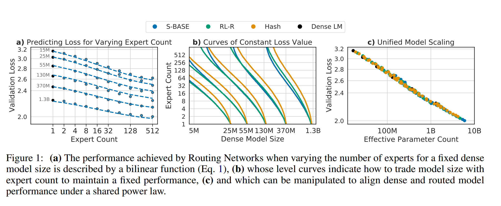

# Unified Scaling Laws for Routed Language Models




This repository holds the data for deriving the main results of the paper
[Unified Scaling Laws for Routed Language Models](https://arxiv.org/abs/2202.01169),
along with a small colab demonstrating how it can be loaded.

[](https://colab.sandbox.google.com/github/deepmind/scaling_laws_for_routing/blob/example.ipynb)

The data format is a simple compressed csv file with hyperparameters and losses
on the validation set and downstream tasks. The scaling laws were derived using
the losses at the end of training, but we provide losses for every `10,000`
steps.

Below is a description of every field in the csv file. For a discussion on the
different datasets, refer to Appendix E.

| Field                   | Description |
| ----------------------- | -------------------------------------------------- |
| `hyper_id`              | A unique identifier per hyperparameter setting |
| `step`                  | The number of training steps the model has trained for before doing that evaluation round. |
| `router_type`           | The technique used to learn and execute the routing. Can be one of `Dense`, `Hash`, `S-Base` and `RL-R`. These techniques are described in Section 3 of the paper. |
| `num_experts`           | The number of experts per routed layer in the model (referred as *E* in the paper). |
| `k`                     | The number experts used per datapoint, *i.e.* if  k=2, the output of the routed layer per token will be an aggregation of two experts. |
| `routing_frequency`     | The fraction of transformer blocks that have a routed layer. *e.g.* a routing_frequency of 0.5 means every other block will be routed, while a frequency of 0.25 means there are three dense blocks between routed blocks. |
| `flop_increase`         | Only relevant for `Dense` models. When  `flop_increase > 1`, the size of the feedforward layer is increased by this factor. This emulates the increase in flops that occurs when increasing `k` in routed models. |
| `d_model`               | The transformer's width parameter. |
| `num_blocks`            | The number of transformer blocks in the model. |
| `num_heads`             | The number heads in the Multihead Attention modules. |
| `kqv_size`              | The dimensionality for the keys, queries and values of each attention head. |
| `seed`                  | The random seed used to initialize the weights. As described in Appendix A, we only varied the seed for a small subset of the runs. |
| `total_parameter_count` | The total number of parameters int the model, including those of all the experts |
| `dense_parameter_count` | The number of parameters seen by a single datapoint. Refer to the paper for a discussion on the distinction of "dense" counts (N) and "total" counts (P) (*e.g.* in Section 2.1) |
| `flops_per_step`        | An estimate of the number of flops for a model's forward-step. |
| `model_size_label`      | A label for the model's size. This should roughly  match `dense_parameter_count`. Can be one of  `15M`, `25M`, `55M`, `130M`, `370M`, `870M` or  `1.3B`. |
| `loss_validation`       | Negative log-likelihood on a held-out portion of the original dataset. |
| `loss_c4`               | Negative log-likelihood on C4 |
| `loss_curation_corpus`  | Negative log-likelihood on the Curation Corpus  dataset. |
| `loss_lambada`          | Negative log-likelihood on the LAMBADA task. |
| `loss_pile`             | Negative log-likelihood on The Pile dataset, EuroParl subset. |
| `loss_wikitext103`      | Negative log-likelihood on the Wikitext103  dataset.|

## Usage

The dataset is uploaded in the repository, in data/curves.csv.gz

You can access it by cloning the repository

```sh
git clone git@github.com:deepmind/scaling_laws_for_routing.git
gunzip scaling_laws_for_routing/data/curves.csv.gz
head scaling_laws_for_routing/data/curves.csv.gz
```

Alternatively, you can load and explore the data in our
[Colab](https://colab.sandbox.google.com/github/deepmind/scaling_laws_for_routing/blob/example.ipynb).

## Citing this work

Our work was presented in ICML 2022. You can cite it with:

```
@InProceedings{clark2022unified,
  title = {Unified Scaling Laws for Routed Language Models},
  author = {Clark, Aidan and Casas, Diego de las and Guy, Aurelia and Mensch, Arthur and Paganini, Michela and Hoffmann, Jordan and Damoc, Bogdan and Hechtman, Blake and Cai, Trevor and Borgeaud, Sebastian and Driessche, George van den and Rutherford, Eliza and Hennigan, Tom and Johnson, Matthew and Millican, Katie and Cassirer, Albin and Jones, Chris and Buchatskaya, Elena and Budden, David and Sifre, Laurent and Osindero, Simon and Vinyals, Oriol and Rae, Jack and Elsen, Erich and Kavukcuoglu, Koray and Simonyan, Karen},
  year = {2022},
  booktitle = {Proceedings of the 39th International Conference on Machine Learning},
  keywords = {Computation and Language (cs.CL), Machine Learning (cs.LG), FOS: Computer and information sciences, FOS: Computer and information sciences},
  publisher = {PMLR},
}
```

## License and disclaimer

Copyright 2022 DeepMind Technologies Limited

All software is licensed under the Apache License, Version 2.0 (Apache 2.0); you
may not use this file except in compliance with the Apache 2.0 license. You may
obtain a copy of the Apache 2.0 license at:
https://www.apache.org/licenses/LICENSE-2.0

All other materials are licensed under the Creative Commons Attribution 4.0
International License (CC-BY). You may obtain a copy of the CC-BY license at:
https://creativecommons.org/licenses/by/4.0/legalcode

Unless required by applicable law or agreed to in writing, all software and
materials distributed here under the Apache 2.0 or CC-BY licenses are
distributed on an "AS IS" BASIS, WITHOUT WARRANTIES OR CONDITIONS OF ANY KIND,
either express or implied. See the licenses for the specific language governing
permissions and limitations under those licenses.

This is not an official Google product.
